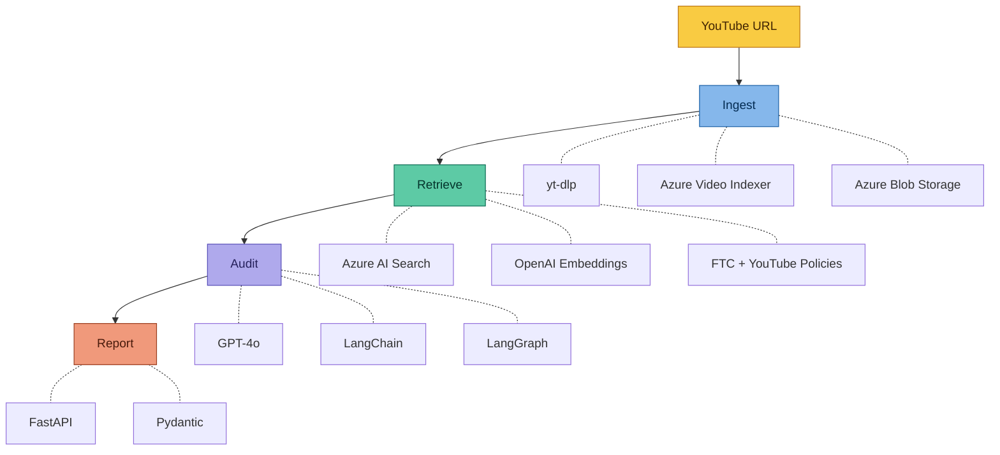

# Brand Guardian AI

An AI-powered compliance pipeline that automates video ad review against FTC endorsement guidelines and YouTube advertising policies. Submit a YouTube URL — get a structured compliance report (PASS/FAIL) with flagged violations, severity levels, and actionable summaries.

Built with **GPT-4o**, **LangGraph**, **RAG (Retrieval-Augmented Generation)**, **Azure Video Indexer**, and **FastAPI**.

---

## Architecture



The system operates as a 4-stage pipeline:

| Stage | What Happens | Technology |
|-------|-------------|------------|
| **Ingest** | Downloads video, extracts transcript (speech-to-text) and on-screen text (OCR) | yt-dlp, Azure Video Indexer |
| **Retrieve** | Searches vector database for the most relevant advertising rules | Azure AI Search, OpenAI Embeddings |
| **Audit** | AI reads transcript + rules and generates a structured compliance judgment | GPT-4o, LangChain, LangGraph |
| **Report** | Outputs PASS/FAIL status with categorized violations and severity levels | FastAPI, Pydantic |

---

## Sample Output

```
=== COMPLIANCE AUDIT REPORT ===
Video ID:    vid_ce6c43bb
Status:      FAIL

[ VIOLATIONS DETECTED ]
- [CRITICAL] Claim Validation: Absolute guarantee detected -- "guaranteed results"
- [WARNING] FTC Disclosure: No sponsorship disclosure found

[ FINAL SUMMARY ]
Video contains 2 violations. One critical claim of guaranteed results
and missing FTC sponsorship disclosure.
```

---

## Tech Stack

- **Orchestration:** LangGraph (directed acyclic graph workflow)
- **LLM:** GPT-4o via Azure OpenAI
- **RAG:** Azure AI Search (vector store) + OpenAI Embeddings
- **Video Processing:** Azure Video Indexer (speech-to-text, OCR)
- **API:** FastAPI with Pydantic validation
- **Telemetry:** Azure Application Insights + LangSmith

---

## Project Structure

```
ComplianceQAPipeline/
├── main.py                          # CLI entry point
├── pyproject.toml                   # Dependencies
├── backend/
│   ├── data/
│   │   └── README.md                # Data source download instructions
│   ├── scripts/
│   │   └── index_documents.py       # One-time: chunk PDFs → vector DB
│   └── src/
│       ├── api/
│       │   ├── server.py            # FastAPI endpoints (/audit, /health)
│       │   └── telemetry.py         # Azure Monitor + LangSmith tracing
│       ├── graph/
│       │   ├── state.py             # Shared state schema (TypedDict)
│       │   ├── workflow.py          # LangGraph pipeline definition
│       │   └── nodes.py             # Indexer + Auditor node logic
│       └── services/
│           └── video_indexer.py     # yt-dlp download + Azure VI client
└── docs/
    └── architecture.png             # System architecture diagram
```

---

## How It Works

### 1. Video Ingestion
The **Indexer Node** downloads the YouTube video via `yt-dlp`, uploads it to Azure Video Indexer, and polls until processing completes. It extracts the full transcript (speech-to-text) and all on-screen text (OCR).

### 2. Rule Retrieval (RAG)
The **Auditor Node** takes the extracted content and queries a vector database (Azure AI Search) for the top matching advertising regulations. The knowledge base is built from FTC influencer guidelines and YouTube ad specs, chunked into ~1000-character segments with 200-character overlap and embedded using OpenAI's embedding model.

### 3. AI Compliance Judgment
The retrieved rules are injected into a structured prompt alongside the video content. GPT-4o evaluates the content against the rules and returns a structured compliance report with violation categories, severity levels, and a human-readable summary.

### 4. Workflow Orchestration
LangGraph manages the pipeline as a directed graph:
```
[START] --> [Indexer Node] --> [Auditor Node] --> [END]
```
Each node reads from and writes to a shared `VideoAuditState`, enabling clean separation of concerns and easy extensibility.

---

## Setup

### Prerequisites
- Python 3.12+
- Azure account with Video Indexer, OpenAI, AI Search, and Blob Storage
- YouTube video URL to audit

### 1. Clone and install
```bash
git clone https://github.com/rahul0443/brand-guardian-ai.git
cd brand-guardian-ai
pip install -r pyproject.toml
```

### 2. Download knowledge base documents
See [`backend/data/README.md`](backend/data/README.md) for download links. Place the PDFs in `backend/data/`.

### 3. Configure environment
Create a `.env` file in the project root:
```env
AZURE_STORAGE_CONNECTION_STRING=your-connection-string
AZURE_OPENAI_API_KEY=your-key
AZURE_OPENAI_ENDPOINT=your-endpoint
AZURE_SEARCH_ENDPOINT=your-endpoint
AZURE_SEARCH_API_KEY=your-key
AZURE_VI_ACCOUNT_ID=your-account-id
AZURE_VI_API_KEY=your-key
APPLICATIONINSIGHTS_CONNECTION_STRING=your-connection-string
LANGCHAIN_API_KEY=your-key
```

### 4. Index the knowledge base (one-time)
```bash
python backend/scripts/index_documents.py
```

### 5. Run
```bash
# CLI
python main.py

# API server
uvicorn backend.src.api.server:app --reload
# Then POST to http://localhost:8000/audit with {"video_url": "https://youtube.com/..."}
```

---

## API Endpoints

| Endpoint | Method | Description |
|----------|--------|-------------|
| `/audit` | POST | Submit a YouTube URL, receive compliance report |
| `/health` | GET | Server health check |

---

## Key Design Decisions

- **RAG over fine-tuning:** Regulations change frequently. RAG lets us update the knowledge base by re-indexing new PDFs without retraining a model.
- **LangGraph over sequential functions:** Graph-based orchestration enables retry logic, conditional branching, and adding new nodes (e.g., content moderation) without refactoring.
- **Vector search over keyword search:** Semantic similarity catches violations even when the video uses different wording than the regulation (e.g., "guaranteed results" matches "misleading claims").
- **Azure Video Indexer over custom models:** Production-grade speech-to-text and OCR out of the box, avoiding months of model development.
